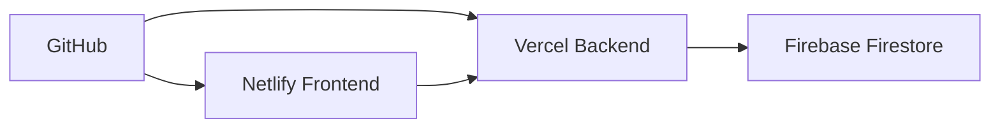

<div align="center">

# 🚀 **Nexus - Smart Management Solutions**

### *Sistema Inteligente de Gestão de Escalas e Recursos Humanos*

[](https://gestao-nrs.netlify.app)
[](https://gestao-nrs-backend.vercel.app)
[](https://firebase.google.com/)

[](https://reactjs.org/)
[](https://nodejs.org/)
[](https://firebase.google.com/)
[](LICENSE)

---

*"Transformando a gestão de recursos humanos com tecnologia inteligente e interface moderna"*

</div>

## 📋 **Sobre o Projeto**

**Nexus** é uma plataforma completa de gestão de escalas e recursos humanos desenvolvida para otimizar o controle de turnos, folgas e analistas em ambientes corporativos. Com uma interface moderna e intuitiva, o sistema oferece sincronização em tempo real entre dispositivos e funcionalidades avançadas de gerenciamento.

### 🎯 **Principais Objetivos**
- ✅ **Automatizar** a criação e gestão de escalas de trabalho
- ✅ **Centralizar** informações de analistas e turnos
- ✅ **Sincronizar** dados em tempo real entre dispositivos
- ✅ **Facilitar** o controle de folgas e pausas
- ✅ **Modernizar** a experiência do usuário

## ⚡ **Funcionalidades Principais**

### 🏢 **Gestão de Analistas**
- 👥 **CRUD Completo** - Criar, editar, visualizar e excluir analistas
- 🔄 **Drag & Drop** - Reordenar analistas dentro dos turnos
- 🔍 **Busca Inteligente** - Localizar analistas rapidamente
- ⏰ **Controle de Pausas** - Definir horários de descanso
- 📅 **Sistema 6x2** - Cálculo automático de folgas

### 🕐 **Gestão de Turnos**
- 🎨 **Personalização Visual** - Cores e nomes customizáveis
- ⏱️ **Horários Flexíveis** - Definir intervalos de trabalho
- 📊 **Organização Intuitiva** - Interface drag & drop
- 🔄 **Sincronização Automática** - Atualizações em tempo real

### 📊 **Escala Inteligente**
- 🤖 **Geração Automática** - Criação inteligente de escalas
- 📈 **Estatísticas Avançadas** - Métricas e análises
- 🎛️ **Configurações Rápidas** - Templates pré-definidos
- 📱 **Responsividade Total** - Funciona em qualquer dispositivo

### 🔐 **Sistema de Usuários**
- 🛡️ **Autenticação Segura** - Login protegido
- 👨‍💼 **Níveis de Acesso** - Administrador e Analista
- 🔄 **Recuperação de Senha** - Sistema de reset automático
- 🌐 **Multi-idioma** - Suporte a português, inglês e espanhol

## 🛠️ **Tecnologias Utilizadas**

### **Frontend**
```javascript
React.js 18+      // Framework principal
CSS3 + Flexbox    // Estilização moderna
Axios/Fetch API   // Comunicação com backend
Local Storage     // Cache local inteligente
```

### **Backend**
```javascript
Node.js + Express // Servidor API
Firebase Auth     // Autenticação
Firestore        // Banco de dados NoSQL
Vercel           // Hospedagem serverless
```

### **Infraestrutura**
```yaml
Frontend: Netlify     # Deploy automático
Backend:  Vercel      # Serverless functions
Database: Firebase    # Cloud Firestore
CDN:      Cloudflare  # Performance global
```

## 🚀 **Como Executar o Projeto**

### **Pré-requisitos**
- Node.js 18.0+ instalado
- Conta Firebase configurada
- Git instalado

### **1. Clone o Repositório**
```bash
git clone https://github.com/Jeferson-Brito/Gestao-NRS.git
cd Gestao-NRS
```

### **2. Instale as Dependências**
```bash
# Frontend
npm install

# Backend
cd server
npm install
```

### **3. Configure as Variáveis de Ambiente**
```bash
# Crie um arquivo .env na raiz do projeto
REACT_APP_API_URL=http://localhost:3001/api
REACT_APP_FIREBASE_CONFIG=your_firebase_config
```

### **4. Execute o Projeto**
```bash
# Terminal 1 - Frontend
npm start

# Terminal 2 - Backend
cd server
npm run dev
```

### **5. Acesse a Aplicação**
- **Frontend:** http://localhost:3000
- **Backend API:** http://localhost:3001

## 🌐 **Deploy em Produção**

### **Acesso Direto**
🔗 **[https://gestao-nrs.netlify.app](https://gestao-nrs.netlify.app)**

### **Credenciais de Teste**
```
Email: jeferson@grupohi.com.br
Senha: @Lionnees14
```

### **Arquitetura de Deploy**


## 📱 **Screenshots**

<div align="center">

### 🎨 **Tela de Login**
*Interface moderna com animações e validação em tempo real*

### 📊 **Dashboard Principal**
*Visão geral com métricas e acesso rápido*

### 👥 **Gestão de Analistas**
*CRUD completo com drag & drop e busca*

### 📅 **Escala Inteligente**
*Geração automática com configurações avançadas*

</div>

## 🔧 **Estrutura do Projeto**

```
Nexus/
├── 📁 public/                 # Arquivos públicos
├── 📁 src/
│   ├── 📁 components/         # Componentes React
│   │   ├── 🔐 Login.js
│   │   ├── 👥 AnalystManagementModal.js
│   │   ├── 🕐 ShiftManagementModal.js
│   │   ├── 📊 EscalaTable.js
│   │   └── 🎨 Dashboard.js
│   ├── 📁 styles/             # Estilos CSS
│   │   ├── 🎨 nexus.css       # Design system
│   │   └── 📱 style.css       # Estilos legados
│   ├── 📁 data/               # Dados e configurações
│   └── 📄 config.js           # Configurações da API
├── 📁 server/                 # Backend Node.js
│   ├── 🔥 vercel-server.js    # Servidor principal
│   ├── ⚙️ firebase-config.js  # Config Firebase
│   └── 📦 package.json        # Dependências backend
├── 📄 netlify.toml            # Config Netlify
├── 📄 vercel.json             # Config Vercel
└── 📖 README.md               # Documentação
```

## 🤝 **Como Contribuir**

### **1. Fork o Projeto**
```bash
git fork https://github.com/Jeferson-Brito/Gestao-NRS.git
```

### **2. Crie uma Branch**
```bash
git checkout -b feature/nova-funcionalidade
```

### **3. Faça suas Alterações**
```bash
git add .
git commit -m "feat: adicionar nova funcionalidade"
```

### **4. Envie um Pull Request**
```bash
git push origin feature/nova-funcionalidade
```

## 📈 **Roadmap**

### **🎯 Versão 2.0**
- [ ] 📊 Dashboard com gráficos avançados
- [ ] 📱 Aplicativo mobile nativo
- [ ] 🔔 Notificações push em tempo real
- [ ] 📈 Relatórios em PDF/Excel
- [ ] 🌙 Modo escuro completo

### **🎯 Versão 2.1**
- [ ] 🤖 IA para otimização de escalas
- [ ] 📧 Integração com email
- [ ] 📱 PWA (Progressive Web App)
- [ ] 🔗 API pública para integrações
- [ ] 🌍 Suporte a mais idiomas

## 👨‍💻 **Autor**

<div align="center">

**Jeferson Brito**

[](https://github.com/Jeferson-Brito)
[](https://linkedin.com/in/jeferson-brito)
[](mailto:jeferson@grupohi.com.br)

</div>

## 📄 **Licença**

Este projeto está sob a licença **MIT**. Veja o arquivo [LICENSE](LICENSE) para mais detalhes.

---

<div align="center">

### 🌟 **Se este projeto te ajudou, deixe uma estrela!** 

**Desenvolvido com ❤️ por [Jeferson Brito](https://github.com/Jeferson-Brito)**

*© 2025 Nexus - Smart Management Solutions. Todos os direitos reservados.*

</div>